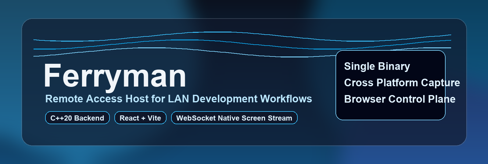

<p align="center">
    
</p>

# Ferryman


English | [中文](README_CN.md)

Ferryman is a **single-process, single-binary remote access and execution host** for LAN scenarios.
After startup it runs a lightweight local HTTP/WebSocket server and serves an embedded browser control plane for:

- file browsing and read/write
- PTY terminal sessions
- async task execution
- runtime logs/audit stream
- WebRTC signaling + native screen streaming and remote input injection

The project keeps frontend and backend in one repository, uses explicit HTTP/WebSocket contracts, and focuses on minimal runtime dependencies, auditability, and extensibility.

## Core Capabilities

### Access and Session Model

- First run bootstraps `~/.ferryman/config.ini` with a generated `access_key`.
- Login uses access key + session token (`X-Session-Token`) for all protected HTTP/WS channels.
- Multiple users can log in at the same time.
- Terminal/task contexts are scoped by session token (`owner_token`) for isolation and traceability.
- Login currently grants command/screen authorization by default (no extra manual approval step).

### Runtime Features

- **Transport layer**: `libhv` HTTP + WebSocket server (single listener; WS and HTTP share one port at runtime).
- **JSON payloads**: parsed/serialized with `nlohmann/json`.
- **File operations**: list/read/write under workspace root (`$HOME` by default), with path boundary checks.
- **Terminal**: child process + PTY (`forkpty`), ANSI passthrough, browser rendering via `xterm.js` (including 256-color support).
- **Tasks**: async command execution with status lifecycle (`queued/running/succeeded/failed`), polling and output retrieval.
- **Logs**:
  - immediate backend output (`stdout/stderr`)
  - in-memory tail buffer via `/api/logs/tail`
  - realtime WS push via `/ws/logs`
- **Screen + remote control**:
  - WebRTC room signaling (`join` / `signal`) channel
  - native screen stream over WS binary frames (`FRM1`)
  - keyboard/mouse event uplink and native input injection
  - codec/fps/resolution/bitrate negotiation for native stream subscribers

### Screen Backends

- macOS: ScreenCaptureKit + ApplicationServices
- Linux: X11 capture + XTest input
- Windows: GDI capture + SendInput
- Encoders:
  - always available: `jpeg`
  - when ffmpeg is available: `h264`, `h265`, `vp8`, `vp9`
- Runtime profiles:
  - FPS: `1..60`
  - Resolution tiers: `full(100%)`, `balanced(75%)`, `performance(50%)`
  - Bitrate tiers: `sd(1.5Mbps)`, `hd(3Mbps)`, `uhd(6Mbps)`

## Architecture

```text
Browser (React/Vite)
  |- /api/*  (HTTP)
  |- /ws/terminal (WebSocket)
  |- /ws/webrtc   (WebSocket)
  `- /ws/logs     (WebSocket)

Ferryman (single process)
  |- SessionManager / Auth (access key)
  |- FileService
  |- PtyManager
  |- TaskManager
  |- AuditLogger
  |- WebRtcSignalingService
  `- ScreenService + VideoEncoder (ffmpeg)
```

## Repository Layout

- `include/ferryman/*`: backend headers
- `src/*`: backend implementation
- `frontend/*`: Vite + React + TypeScript control panel
- `cmake/EmbedAssets.cmake`: embed `frontend/dist` into generated C++ source
- `scripts/make_deps.sh`: dependency bootstrap
- `Makefile`: one-command workflows

## Build and Run

### 0) Install C++ dependencies (vcpkg)

```bash
make deps
```

`make deps` includes:

- local downloads cache: `.vcpkg-downloads`
- local binary cache: `.vcpkg-binary-cache`
- archive prefetch + SHA-512 verification (nlohmann-json / meson / ffmpeg), with mirror fallback URLs

Optional proxy mode (if local `useProxy` command exists):

```bash
make deps-proxy
```

Optional mirror/proxy envs:

- `FERRYMAN_USE_PROXY=1`
- `NLOHMANN_JSON_URL=<mirror-url>`
- `MESON_URL=<mirror-url>`
- `FFMPEG_URL=<mirror-url>`
- `GITHUB_MIRROR_PREFIX=<prefix>`
- `VCPKG_ASSET_SOURCES=<asset-source-config>` (passed through to `X_VCPKG_ASSET_SOURCES`)

For Windows single-exe builds without third-party DLLs, use a static triplet:

```powershell
$env:VCPKG_TARGET_TRIPLET = "x64-windows-static"
cmake -S . -B build -A x64 `
  -DCMAKE_BUILD_TYPE=Release `
  -DCMAKE_TOOLCHAIN_FILE="$env:VCPKG_ROOT/scripts/buildsystems/vcpkg.cmake" `
  -DVCPKG_TARGET_TRIPLET=$env:VCPKG_TARGET_TRIPLET
cmake --build build --config Release --parallel
```

### 1) Build frontend assets

```bash
make frontend
```

### 2) Build backend

```bash
make build
```

### 3) Run

```bash
make run
```

On first run, Ferryman generates and prints an access key, and writes config to `~/.ferryman/config.ini`.

### One-command release build

```bash
make release
```

## Split Development Mode

Run backend and frontend separately.

Terminal 1:

```bash
make dev-backend
```

Terminal 2:

```bash
make dev-frontend
```

Open:

- `http://127.0.0.1:5173`

Optional proxy override:

```bash
cd frontend
VITE_BACKEND_HTTP_URL=http://127.0.0.1:28080 \
VITE_BACKEND_WS_URL=ws://127.0.0.1:28080 \
npm run dev -- --host
```

## Runtime Configuration

Default config file: `~/.ferryman/config.ini`

```ini
access_key=<generated>
http_host=0.0.0.0
http_port=18080
https_enabled=false
https_port=18443
tls_cert_file=
tls_key_file=
ws_port=18080
```

Note:

- HTTP and WebSocket share the same listener port at runtime.
- Set `https_enabled=true` to enable HTTPS/WSS. HTTP/WS stay available on `http_port`.
- If `tls_cert_file`/`tls_key_file` are empty, Ferryman auto-generates `~/.ferryman/cert/server.crt` and `~/.ferryman/cert/server.key` on first HTTPS startup.
- Auto-generated certificate paths are written back into `~/.ferryman/config.ini` (`tls_cert_file` / `tls_key_file`).
- Ferryman also initializes `~/.ferryman/logs/` and reserves `audit.log` path for audit output.

## HTTP API

| Method | Path | Description |
|---|---|---|
| `POST` | `/api/auth/login` | Access key login |
| `GET` | `/api/session/me` | Session info |
| `GET` | `/api/files/list` | List directory |
| `GET` | `/api/files/read` | Read file |
| `POST` | `/api/files/write` | Write file |
| `POST` | `/api/tasks/start` | Start async task |
| `GET` | `/api/tasks/list` | List tasks |
| `GET` | `/api/tasks/get` | Task detail/output |
| `GET` | `/api/logs/tail` | Tail runtime audit logs |
| `GET` | `/api/screen/capabilities` | Screen capability negotiation |
| `POST` | `/api/screen/input` | Native input injection |
| `GET` | `/api/health` | Health check |

## WebSocket Channels

### `/ws/terminal`

Actions:

- `open`
- `attach`
- `input`
- `resize`
- `close`

### `/ws/webrtc`

Actions:

- `join` (room signaling peer join)
- `signal` (SDP/ICE payload forwarding)
- `native_subscribe`
- `native_unsubscribe`
- `input_event`

### `/ws/logs`

Actions:

- `tail`
- `snapshot`

## Native Screen Streaming

- Transport: WebSocket binary packet (`FRM1` header)
- Codec IDs:
  - `1`: JPEG
  - `2`: H.264
  - `3`: H.265
  - `4`: VP8
  - `5`: VP9
- Backend negotiates codec/fps/resolution/bitrate based on active subscribers.

If ffmpeg is unavailable, native video encoding is disabled and capability negotiation falls back accordingly.

## Security Model

- LAN-oriented deployment (default host: `0.0.0.0`).
- Access-key login required.
- Session token required for protected HTTP/WS endpoints.
- Login grants command/screen access by default (current behavior).
- Key actions are auditable through:
  - immediate backend console logs
  - in-memory log tail (`/api/logs/tail`, `/ws/logs`)
- Session-scoped ownership is applied to terminal/task operations.

## Build Notes

- `vcpkg` manifest mode via `vcpkg.json`
- Frontend assets are embedded by `cmake/EmbedAssets.cmake`
- If `libhv` is missing, backend still compiles but server startup fails with guidance.
- On macOS, native screen and input features require system permissions:
  - Screen Recording
  - Accessibility

## Contributing

Please read [CONTRIBUTING.md](CONTRIBUTING.md) before opening a PR.

## License

This project is licensed under the [MIT License](LICENSE).
